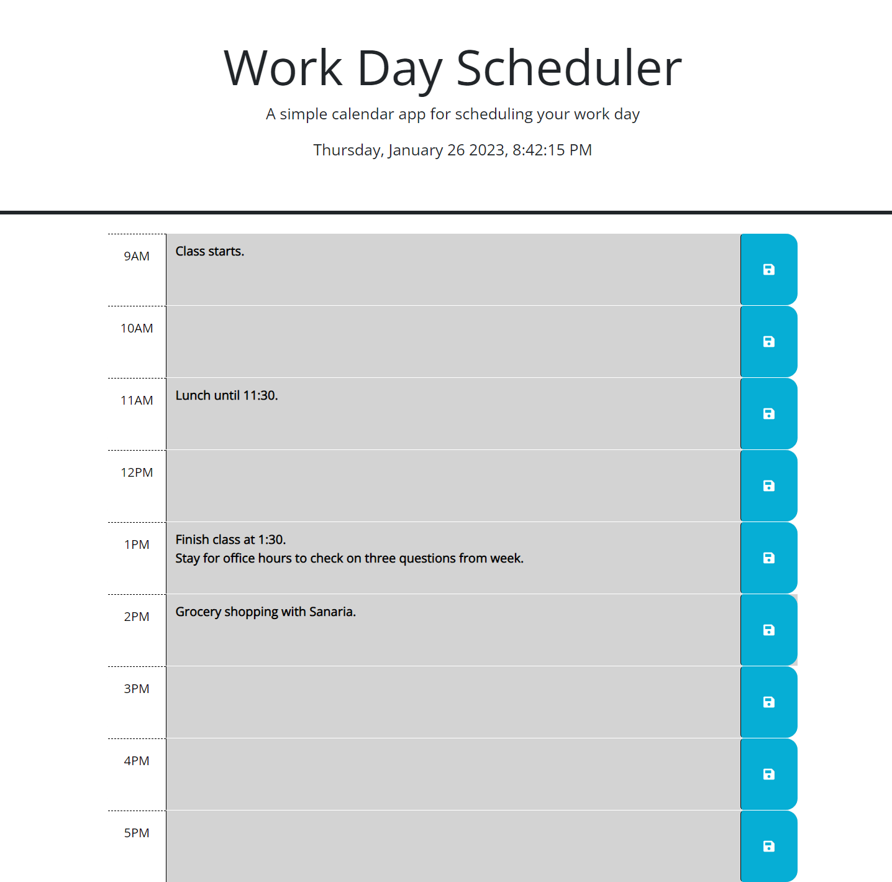

# Work Day Scheduler

## Description

In this repository you will find modifications and additions made to a webpage displaying a simple work day schedule maker.

Using third party APIs, JavaScript, and a touch of HTML and CSS, I was able to add dynamic features to the existing webpage. These include a second by second updated date and time display in the header, as well as dynamically styled time blocks.

Lastly, using jQuery, I was able to store information in local storage to be recalled upon a browser refresh.

## Usage

In order to access the features of the scheduler, simply input text into any of the nine time blocks corresonding to a different hour of the work day. 

Once finished, press the blue save button in the time block you would like to save your entry. If you navigate away from the page and back, you will find your entry still present in the timeblock you placed it in. If you wait an hour to come back and check, you'll also notice that the color of the current time block has changed to red from green, while the recent one has changed to grey, denoting the hour has passed.

Wesbite URL: http://kirkhagglund.github.io/work-day-scheduler/

'''md

'''

## Credits

This project would not have been possible without the close collaboration of three of my bootcamp classmates. Rebecca Lawrence, Mario Repas, Cassandra Watson, and myself worked together while creating the JavaScript and HTML modifications to launch this website. 

Also of noteworthy assistance was documentation from Mdn among other resources regarding a few aspects of this project.

Documentation on setting information to local storage: https://developer.mozilla.org/en-US/docs/Web/API/Storage/setItem

Documentation and adoption of the dayjs library and formatting: https://day.js.org/docs/en/display/format

Styling was performed using preset formatting from bootstrap: https://getbootstrap.com/docs/5.1/layout/containers/

## License

MIT License Copyright (c) 2023 KirkHagglund

